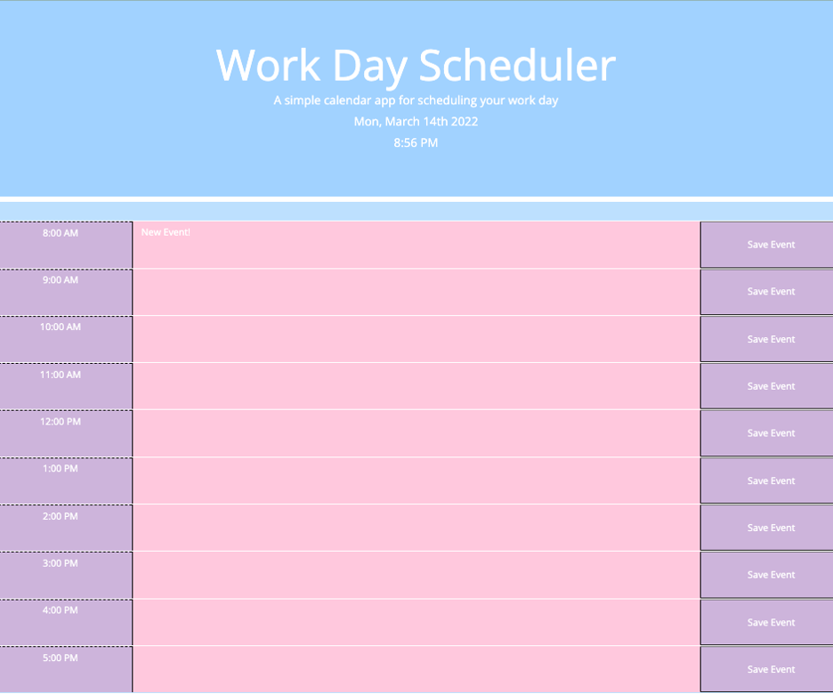

# Caitlin Stevenson|Day Planner Assignment

## Objectives

In this project, I created a simple work day planner using HTML, CSS, Javascript, and Web APIs. I was able to successfully set up the current date and time in the header of the webpage using MomentJS. The user can also enter and save new events thanks to the utilization of local storage. 

## Screenshot of Final Page

## Link To The Final Page

[Link to final webpage](https://caitlinscodes.github.io/day_planner/)

## License

This code is licensed under the MIT License.